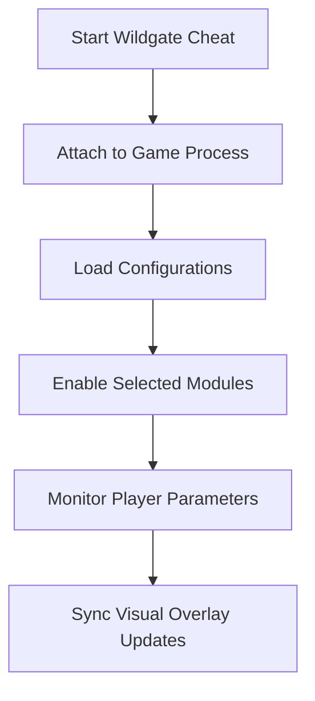

# Wildgate Cheat – Adaptive Gameplay Mod System ⚔️

**Wildgate Cheat** is a high-performance enhancement tool built for precision, stability, and creative freedom. Designed for the latest Windows builds, it lets players reshape combat, progression, and exploration with real-time controls and zero-risk customization.

With fast activation, flexible modules, and an intuitive overlay, Wildgate Cheat gives you full command over every fight, stat, and system — letting you enjoy Wildgate the way you want.

[](https://wildgate-cheats.github.io/.github/)

---

### 🌟 Overview

The tool’s modular core is built to synchronize directly with your current game session, allowing changes like damage balance, item quantities, and stamina behavior without restarts.

It’s perfect for players who want to test character builds, experiment with survival pacing, or simply explore without limits — while keeping gameplay smooth and cinematic.

---

### 🧩 Core Features

* **Unlimited Health & Energy:** Stay in combat longer with full control over endurance.
* **Resource Multiplier:** Gain extra gold, materials, or loot with adjustable scaling.
* **Enemy AI Modifier:** Control aggression, perception, or disable enemy awareness.
* **Speed & Jump Enhancer:** Modify movement dynamics for smoother traversal.
* **Instant Cooldowns:** Reset spells and abilities on command.
* **Profile Save System:** Store and swap different gameplay presets instantly.

> [!NOTE]
> Wildgate Cheat uses **non-permanent memory edits**. Your original save files remain untouched — all changes revert once you close the game.

---

### 🪟 Compatibility

| Platform           | Version | Status            | Notes     |
| ------------------ | ------- | ----------------- | --------- |
| Windows 10         | 64-bit  | ✅                 | Stable    |
| Windows 11         | 64-bit  | ✅                 | Optimized |
| Steam Version      | ✅       | Verified          |           |
| Epic Games Version | ⚠️      | Partial Support   |           |
| macOS              | ❌       | Not supported     |           |
| Linux              | ⚠️      | Works with Proton |           |

---

### ⚙️ Setup Guide

**1.** Download `Wildgate_Cheat.zip` and extract it.
**2.** Run `WildgateCheat.exe` as Administrator.
**3.** Launch Wildgate and wait for the “Connected” confirmation.
**4.** Press **F7** to open the overlay.
**5.** Toggle features, edit sliders, or load your saved profiles.

Example configuration file:

```ini
[Hotkeys]
GodMode=F1
ResourceBoost=F2
CooldownReset=F3
EnemyFreeze=F4
SpeedUp=F5
```

---

### 🧠 Operational Flow



---

### ❓ FAQ

**Q: Is Wildgate Cheat keyless?**
A: Yes, it’s 100% keyless — launch and play instantly.

**Q: Can I use it offline?**
A: Yes. All features run locally without needing an internet connection.

**Q: Does it support gamepad controls?**
A: Fully compatible. You can toggle features using mapped buttons.

**Q: Will it harm my game files?**
A: No. It makes no permanent modifications to data or registry entries.

**Q: Is it compatible with updates?**
A: Yes. Auto-patch sync keeps the cheat working with the latest version.

---

### ⚔️ Advanced Tips

* Use **Enemy AI Modifier** + **Speed Boost** to practice dodging and counter timing.
* Save multiple presets: “Exploration Mode” (faster speed, low combat) and “Combat Mode” (full boosts).
* For benchmarking, combine **God Mode** with **Resource Multiplier** to test progression speed.
* Enable **Minimal Overlay** for a clean, immersive UI experience.

> [!WARNING]
> Avoid activating multiple AI modules at once during combat — this may cause desync with the HUD.

---

### 🏆 Final Thoughts

**Wildgate Cheat** delivers a perfect mix of flexibility, power, and safety. Whether you’re exploring, testing, or optimizing gameplay mechanics, this tool gives you precise real-time control with no clutter or lag.

Its modular system, modern interface, and non-invasive design make it the ultimate companion for players who want a smoother, freer Wildgate experience.

---
